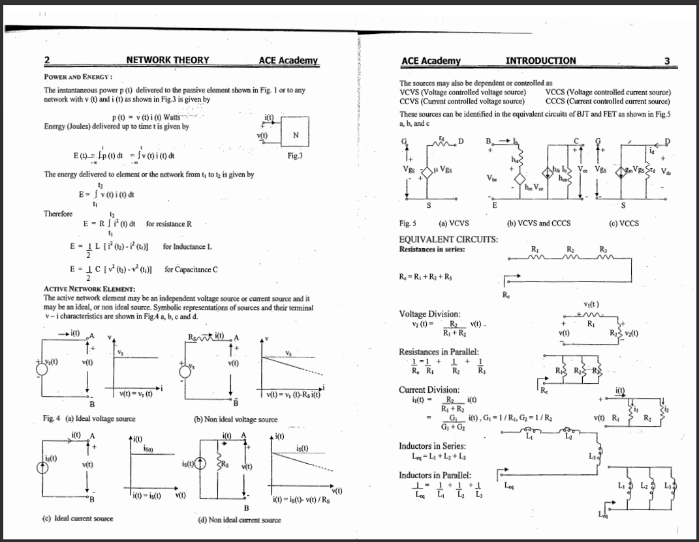
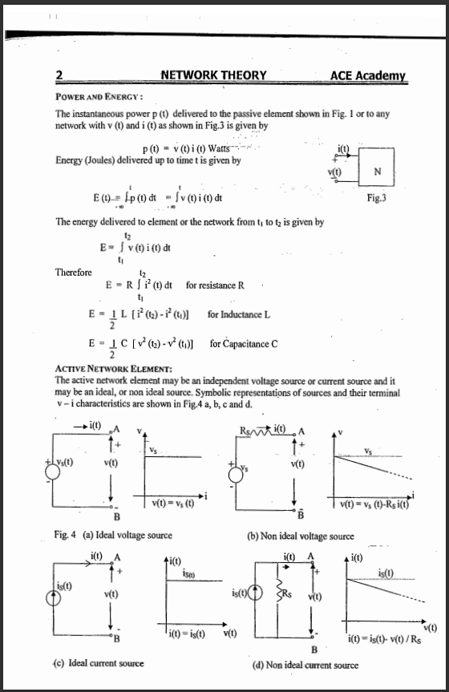
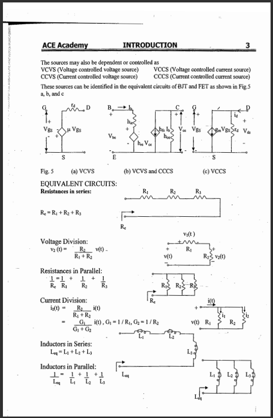

# pdf-crop-splitter
spilits scanned pdf pages at midpoint

converts scanned pdf materials like this

to this

made for personal use made available to the public
feel free to download modify and use
